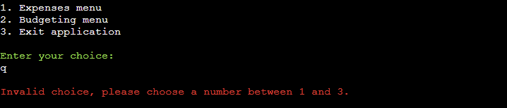

# Expense Tracker

The Expense Tracker app aims to simplify financial management by providing users with tools to track expenses, manage budgets, and analyze spending habits efficiently.

visit the deployed site [here](https://expense-tracker-pp3-3b6c5c8af8ba.herokuapp.com/)

## Table of Contents
1. [User Experience (UX)](#user-experience-UX)
    1. [Project Goals](#project-goals)
    2. [User Stories](#user-stories)
    3. [Data Model](#data-model)
    4. [Flowchart](#flowchart)
2. [Features](#features)
    1. [Add Expense](#add-expense)
    2. [View Expenses](#view-expenses)
    3. [View Expenses by Category](#view-expenses-by-category)
    4. [Set Up New Budget / Edit Existing Budget](#set-up-new-budget-edit-existing-budget)
    5. [View Budgets](#view-budgets)
3. [Technologies Used](#technologies-used)
    1. [Language Used](#language-used)
    2. [Frameworks, Libraries and Programs Used](#frameworks-libraries-and-programs-used)
4. [Testing](#testing)
    1. [Testing User Stories](#testing-user-stories)
    2. [Code Validation](#code-validation)
    3. [Manual Testing](#manual-testing)
5. [Deployment](#deployment)
6. [Credits](#credits)

***
## User Experience

### Project goals

* Efficient Expense Tracking: Develop a system that allows users to easily track their expenses and budgets.

* User-Friendly Interface: Create an intuitive and user-friendly interface for adding expenses, setting up budgets, and viewing financial data.

* Category-Based Budgeting: Enable users to set up budgets for different expense categories to better manage their finances.

* Real-Time Updates: Provide real-time updates on expenses and budgets to keep users informed about their financial status.

### User stories
* As a user, I want to add new expenses to my budget plan, including details such as expense name, amount, date, and category, so that I can keep track of my spending habits accurately.

* As a user, I want to view all expenses recorded in my budget plan, including details such as expense name, amount, date, and category, so that I can review my spending history.

* As a user, I want to view expenses filtered by category, allowing me to see expenses specific to a particular category and analyze my spending patterns.

* As a user, I want to set up new budgets or edit existing budgets for different expense categories, specifying the budget amount and tracking my expenses against it.

* As a user, I want to view all budgets I have set up, including details such as category, budget amount, current expenses, and remaining budget, to monitor my financial goals and progress.

* As a user, I want the application to provide real-time updates on my expenses and budgets, ensuring that I have the most up-to-date financial information available.

### Data Model

* Data Model and Application Features
    * The Expense Tracker app employs a Google Sheets-based data model, comprising two sheets: Expenses and Budgets. The Expenses sheet records individual expenses, while the Budgets sheet tracks budget details for various spending categories.

* Data Manipulation
    * Users can add, view, and manage expenses and budgets through the app. Input validation ensures data integrity when adding expenses, and updates to budget categories are automatically reflected based on expense entries.

### Flowchart

The following flowchart was designed using [draw.io](https://app.diagrams.net/)

## Features

### Add Expense
Users can add a new expense to their budget plan by providing details such as expense name, amount, date, and category.

### View Expenses
Users can view all expenses recorded in their budget plan, including details such as expense name, amount, date, and category.

### View Expenses by Category
Users can view expenses filtered by category, allowing them to see expenses specific to a particular category.

### Set Up New Budget / Edit Existing Budget
Users can set up a new budget or edit an existing budget for different expense categories. They can specify the budget amount and track their expenses against it.

### View Budgets
Users can view all budgets they have set up, including details such as category, budget amount, current expenses, and remaining budget.

## Technologies Used

### Language Used

* [Python3](https://en.wikipedia.org/wiki/Python_(programming_language))

### Frameworks, Libraries and Programs Used

* [GitHub](https://github.com/) was used to store the project after pushing.

* [GitPod](https://gitpod.io/) was used for writing code, committing, and then pushing to GitHub.

* [Heroku](https://id.heroku.com/) was used to deploy the application.

* [Tabulate](https://pypi.org/project/tabulate/) was used to print table in a readable manner

* [Code Institutes Python Linter](https://pep8ci.herokuapp.com/#) was used to help me validate my code

* [draw.io](https://app.diagrams.net/) was used to create the flowchart diagram

* Google sheets was used to read and write data to

## Testing

### Testing User Stories

### Code validation

* [Code Institutes Python Linter](https://pep8ci.herokuapp.com/#) was used to help me validate my code. It pointed out that I had a lot of missing blank lines between functions, redundant white space and that a lot of my lines were greater than 79 characters long.

* I have fixed all the errors that arose

### Manual testing

<table>
    <tr>
        <th>Feature</th>
        <th>Outcome</th>
        <th>Example</th>
        <th>Pass/Fail</th>
    </tr>
    <tr>
      <td rowspan="2">Main Menu</td>
      <td>Enter a non-numeric character and ensure it prompts with the appropriate error message.</td>
      <td></td>
      <td>PASS</td>
    </tr>
    <tr>
      <td>Enter a numeric character that is not within the selection range and ensure it prompts with the appropriate error message</td>
      <td></td>
      <td>PASS</td>
    </tr>
    <tr>
      <td rowspan="2">Expense Menu</td>
      <td>Enter a non-numeric character and ensure it prompts with the appropriate error message</td>
      <td></td>
      <td>PASS</td>
    </tr>
    <tr>
      <td>Enter a numeric character that is not within the selection range and ensure it prompts with the appropriate error message</td>
      <td></td>
      <td>PASS</td>
    </tr>
    <tr>
      <td rowspan="2">Add New Expense - Validate expense name</td>
      <td>Leave the expense name empty and ensure it prompts with the appropriate error message</td>
      <td></td>
      <td>PASS</td>
    </tr>
    <tr>
      <td>Enter an expense name that exceeds the maximum allowed length and ensure it prompts with the appropriate error message</td>
      <td></td>
      <td>PASS</td>
    </tr>
    <tr>
      <td rowspan="2">Add New Expense - Validate expense amount</td>
      <td>Enter a non-numeric value and ensure it prompts with the appropriate error message</td>
      <td></td>
      <td>PASS</td>
    </tr>
    <tr>
      <td>Enter an invalid amount with more or less than two decimal places and ensure it prompts with the appropriate error message</td>
      <td></td>
      <td>PASS</td>
    </tr>
    <tr>
      <td rowspan="2">Validate expense date format</td>
      <td>Enter an invalid date format and ensure it prompts with the appropriate error message</td>
      <td></td>
      <td>PASS</td>
    </tr>
    <tr>
      <td>Enter an invalid date format in the future and ensure it prompts with the appropriate error message</td>
      <td></td>
      <td>PASS</td>
    </tr>
    <tr>
      <td>Enter an invalid date format in the futpasture and ensure it prompts with the appropriate error message</td>
      <td></td>
      <td>PASS</td>
    </tr>
    <tr>
      <td rowspan="2">Validate expense category</td>
      <td>Enter a non-numeric value and ensure it prompts with the appropriate error message</td>
      <td></td>
      <td>PASS</td>
    </tr>
    <tr>
      <td>Enter a numeric value that is not within the selection range and ensure it prompts with the appropriate error message</td>
      <td></td>
      <td>PASS</td>
    </tr>
    <tr>
      <td rowspan="2">View All Expenses</td>
      <td>Verify that the expense table is displayed correctly</td>
      <td>PASS</td>
    </tr>
    <tr>
      <td>Press any key to return to the main menu</td>
      <td>PASS</td>
    </tr>
    <tr>
      <td rowspan="2">View Expenses by Category</td>
      <td>Verify that a list of available categories is displayed</td>
      <td>PASS</td>
    </tr>
    <tr>
      <td>Press any key to return to the main menu</td>
      <td>PASS</td>
    </tr>
    <tr>
      <td>Budget Menu</td>
      <td>Verify that the budget category is displayed correctly</td>
      <td>PASS</td>
    </tr>
    <tr>
      <td rowspan="2">Set up new/ Edit existing budget - Validate budget amount</td>
      <td>Enter a non-numeric value and ensure it prompts with the appropriate error message</td>
      <td>IMAGE PLACEHOLDER</td>
      <td></td>
    </tr>
    <tr>
      <td>Enter an invalid amount with more or less than two decimal places and ensure it prompts with the appropriate error message</td>
      <td>IMAGE PLACEHOLDER</td>
      <td></td>
    </tr>
    <tr>
      <td rowspan="2">Set up new/ Edit existing budget</td>
      <td>Check for duplicate budget categories and ensure it prompts with the appropriate error message</td>
      <td>IMAGE PLACEHOLDER</td>
      <td></td>
    </tr>
    <tr>
      <td>Provide an option to enter a new budget amount</td>
      <td>IMAGE PLACEHOLDER</td>
      <td></td>
    </tr>
    <tr>
      <td rowspan="2">Real-time Calculations</td>
      <td>Verify that budget calculations are accurate and updated in real-time</td>
      <td>PASS</td>
    </tr>
    <tr>
      <td>Verify that remaining budget amounts are calculated correctly</td>
      <td>PASS</td>
    </tr>
</table>

## Deployment 

The application has been deployed using [Heroku](https://id.heroku.com/) by following these steps:

[Heroku](https://id.heroku.com/) was used to deploy the application.

1. Create the requirements.txt file and run: `pip3 freeze > requirements.txt` in the console.
2. Commit changes and push them to GitHub.
3. Go to the Heroku's website.
4. From the Heroku dashboard, click on "Create new app".
5. Enter the "App name" and "Choose a region" before clicking on "Create app".
6. Go to "Config Vars" under the "Settings" tab.
7. Click on "Reveals Config Vars" and add the KEY: CREDS and the VALUE stored in creds.json file if needed.
8. Add the Config Var, KEY: PORT and VALUE: 8000.
9. Go to "Buildpacks" section and click "Add buildpack".
10. Select "python" and click "Save changes"
11. Add "nodejs" buildpack as well using the same process.
12. Go to "Deployment method", under the "Deploy" tab select "GitHub" and click on "Connect to GitHub".
13. Go to "Connect to GitHub" section and "Search" the repository to be deployed.
14. Click "Connect" next the repository name.
15. Choose "Automatic deploys" or "Manual deploys" to deploy your application.

## Credits
